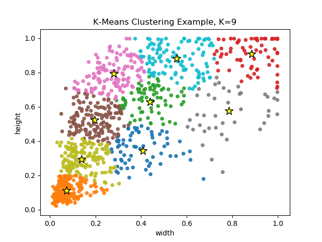

# Finding Anchor Boxes using K-Means

 

    
    

 
 
In this project, I'll try to use K-Means to get anchor boxes that might be the 
best fit for a data set. Anchor boxes are commonly used in state-of-the-art 
object detection models to encode information about the scale and aspect ratio 
of specific object classes. The K-Means algorithm tries to partition N observations 
into K clusters in which each observation is labeled to a cluster with the nearest 
centroid. In this case, each centroid represents the coordinates of an anchor box.
This project uses PASCAL VOC 2012 data set, but with objects from 5 chosen classes 
instead of 20.

## Visualizing Width-Height Ratios

    I started off by just looking at the width and height ratios of the objects in the CSV file.
    It's pretty unnecessary, but I made some visualizations which I thought would provide some
    details about the distribution of each width-height pairs. I first looked at the density for
    for 10,000 of the points in the file using some SciPy function I found called "Gausian KDE":

 

    

 

    As I expected, the points are pretty much all over the place, but still shows a pattern of 
    concentration around the bottom-left. The slope leans towards the y-axis probably because
    this data set has way more objects that are identified as a person, meaning the height is greater
    than the width for most objects.
    For next visualization, I tried to plot the point densities by classes from the data set. 
    I had to set number of samples to 500, otherwise it takes forever to compute.

 

    

 

    This plot is more interesting because it shows why an anchor boxes are useful. Different classes 
    have a certain pattern of aspect-ratios and sizes that might fit them better. Encoding these 
    values into a object detection model might be pretty helpful. 

## Finding optimal K

    Probably the most important part to this whole analysis is finding the optimal K such that
    the variance is the lowest, while preserving costs related to fitting the model for greater
    number of clusters. To do this, people usually make an "elbow plot" which describes the 
    variances as a function of the value of K used in the model. The value of K which sees great
    reduction in variance as compared to lower values but sees diminishing improvements for greater
    values, AKA the "elbow point", is probably the optimal value of K to use for the data set.
    For the K-Means model, we are going to just select Scikit-Learn's 
    standard K-Means clustering model, which includes a parameter called "inertia" that describes
    the sum of squared errors, good for gauging the variances of the clusters.
    Here is the resulting elbow plot:

 

    

 

    Looking at the plot, the optimal K is probably around 4-5 clusters. I'll choose K=5.
    I'll also choose values K=6 and K=9 because models such as YOLO has 3 anchors assigned
    to each scale to predict objects, and typically contain 2-3 scales of predictions.

## Finding the Anchors

    Now that I picked the number of clusters, I just needed to use K-Means and fit the data for
    each K. Then I can save the cluster centers (centroids), which are going to be the anchor boxes.
    I thought it would be pretty cool to have some visualiztions so I also plotted something
    called a "Voronoi diagram" for each model, which can be used to visualize the boundaries lines 
    for each cluster alongside the centroids. 

 

    
    
    

 

## Better Methods

This might not be the best way to utilize K-Means to find anchor boxes tailored to a data set,
but it is pretty simple and probably works fine enough (I'll have to test it). I intended for this project to
be just a practice for myself, because I usually don't mess around with clustering algorithms. I saw some tutorials 
that use some smart implementation of K-Means that utilized IoUs as the metric instead of euclidean distance.
I'll probably create another repo in the future to cover that metric, but that will require creating
my own K-Means implementation because Scikit-Learn's model probably doesn't support custom distance functions.
This might be because K-Means is made for euclidean distance, and any other distance function will not be
appropriate.